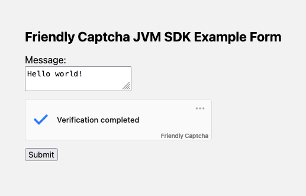

# Friendly Captcha JVM SDK

A Java SDK for [Friendly Captcha](https://friendlycaptcha.com) that can be used from JVM languages like Java, Kotlin, Scala, Clojure, Groovy, etc. This SDK provides a simple way to interact with the Friendly Captcha API.

> This library is for [Friendly Captcha v2 only](https://developer.friendlycaptcha.com/). If you are looking for a v1 library, we recommend using [dheid/friendlycaptcha](https://github.com/dheid/friendlycaptcha).

## Installation

Add the following dependency to your `pom.xml`:

```xml
<dependency>
    <groupId>com.friendlycaptcha</groupId>
    <artifactId>friendly-captcha-jvm</artifactId>
    <version>1.0.0</version>
</dependency>
```

## Usage

First we create a client - you usually only create one and re-use it.
```java
FriendlyCaptchaClient client = new FriendlyCaptchaClient(
    new FriendlyCaptchaClientOptions()
                        .setApiKey(apiKey)
                        .setSitekey(sitekey)
);
```

Then we can use the client to verify the captcha response (which is sent in the `frc-captcha-response` form field by default) in a request handler or middleware:
```java
// ...
String responseToken = formData.get("frc-captcha-response");
VerifyResult result = client.verifyCaptchaResponse(responseToken).get();

if (!result.wasAbleToVerify()) {
    // Alert yourself: something went wrong, we weren't able to verify the captcha.
    // Maybe the API is down, or your credentials are incorrect.
    System.out.println("COULD NOT VERIFY FRIENDLY CAPTCHA RESPONSE!\n" + 
    "> Error Code: " + result.getErrorCode() + "\n" +
    "> Response Error: " + result.getResponseError());
}

if (!result.shouldAccept()) {
    // The captcha should be rejected.
    // Alert the user that they should try again.

    model.put("message", "❌ Captcha verification failed! Please try again.");
    exchange.sendResponseHeaders(400, 0);
    return;
}

// Captcha verification successful, continue with your application logic.
// ...
```

## Example

A standalone example can be found in [src/main/java/com/friendlycaptcha/sdk/Example.java](src/main/java/com/friendlycaptcha/sdk/Example.java).

This example serves a HTML form with a Friendly Captcha widget and validates the user's response.



To run the example, execute the following commands:

```shell
mvn clean install

FRC_SITEKEY=<your sitekey> FRC_APIKEY=<your api key> mvn exec:java -pl examples -Dexec.mainClass="com.friendlycaptcha.examples.Example"
```

Then open [http://localhost:8080](http://localhost:8080) in your browser.

## License
This is open-source software licensed under the [MIT license](LICENSE).
